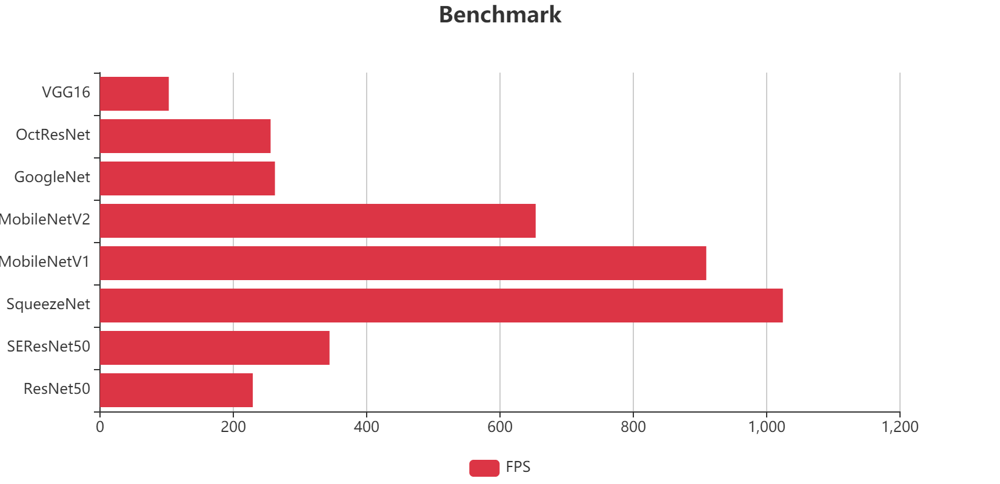

### TFDL2 性能基准测试

注：TFDL2运行速度基于Think-Force NPU，测试使用单线程推理，批大小为1。全7140平台为8颗NPU并行。



#### 测试工具使用方法

Benchmark工具用于测试模型在NPU上的推理性能，支持多线程并发测试和软硬件结果校验。

```bash
./Benchmark <模型路径> <线程数> <测试轮数> <verbose> <config.json路径> <测试图片路径> <是否校验>
```

| 参数 | 说明 |
|------|------|
| arg1 | 测试模型的绝对路径（`.fb`格式） |
| arg2 | 测试的线程数，每个线程对应一个独立执行体 |
| arg3 | 测试批数量，总推理次数 |
| arg4 | 是否开启verbose模式（1=开启，0=关闭）。开启时只运行一个epoch并打印详细信息 |
| arg5 | 模型构建参数json路径（config.json） |
| arg6 | 模型的测试图片输入路径 |
| arg7 | 是否开启结果校验（1=开启，0=关闭）。校验模式会比较硬件与软件推理结果，会影响速度 |

**示例：**
```bash
# 8线程运行2000次推理，不校验结果
./Benchmark model.fb 8 2000 0 runconfig.json test.jpg 0

# 单线程校验模式，打印详细调试信息
./Benchmark model.fb 1 1 1 runconfig.json test.jpg 1
```

**config.json 示例：**
```json
{
    "UseHardware": true,
    "FrugalMode": true,
    "optimize": {
        "DoAlign": false,
        "TryReverse": false,
        "HighAccuracy": true,
        "SplitDeconv": true
    },
    "InputShape": [
        {"NodeName": "images", "Shape": [1, 3, 640, 640]}
    ]
}
```

#### 目标检测性能

| 模型 | 输入尺寸 | 单NPU (QPS) | 8xNPU (QPS) | 单帧延迟(ms) |
|------|---------|-------------|-------------|-------------|
| YOLOv5s | 640x640 | 45.6 | 295.5 | 21.9 |
| YOLOv8s | 640x640 | 52.5 | 304.8 | 19.1 |
| YOLOv11s | 640x640 | 30.7 | 206.8 | 32.5 |

#### OCR 性能

| 模型/任务 | 说明 | 单NPU (QPS) | 8xNPU (QPS) |
|-----------|------|-------------|-------------|
| BaiduOCR v5 rec server | 文字识别（字符/秒） | 1417.6 | 9873.9 |
| BaiduOCR v5 det server | 文字检测 960x448 | 3.6 | 23.0 |

#### 语义分割性能

| 模型 | 输入尺寸 | 单NPU (QPS) | 8xNPU (QPS) |
|------|---------|-------------|-------------|
| STDC | 512x512 | 101.1 | 557.7 |
| PP-Lite | 1024x512 | 40.2 | 209.3 |

#### 图像分类性能

| 模型 | 输入尺寸 | 单NPU (QPS) | 8xNPU (QPS) |
|------|---------|-------------|-------------|
| ResNet-50 | 224x224 | 209.2 | 1525.0 |

#### ReID 特征提取性能

| 模型 | 输入尺寸 | 单NPU (QPS) | 8xNPU (QPS) |
|------|---------|-------------|-------------|
| Baidu Reid | - | 242.6 | 1967.6 |
| StrReid | 192x384 | 127.2 | 900.5 |

#### 人体关键点估计性能

| 模型 | 输入尺寸 | 单NPU (QPS) | 8xNPU (QPS) |
|------|---------|-------------|-------------|
| YOLOv8m-pose | 640x384 | 43.6 | 266.4 |
| YOLOv11m-pose | 640x384 | 27.9 | 185.5 |
| PoseNet | 192x256 | 158.5 | 1262.3 |
| OpenPose | 192x288 | 31.0 | 210.8 |

#### ViT类大视觉模型性能

| 模型 | 输入尺寸 | 单NPU (QPS) | 8xNPU (QPS) |
|------|---------|-------------|-------------|
| Efficient SAM-s | 1024x1024 | 1.9 | 9.8 |
| CLIP-V/L | 224x224 | 10.6 | 75.3 |
| DepthAnythingV2-small | 630x378 | 7.8 | 35.1 |
| DINOv2-base | 448x448 | 8.3 | 38.2 |

#### 性能优化建议

1. **量化模型**：INT8量化模型在NPU上的推理速度远超FP32，是获得最佳性能的前提。
2. **FrugalMode**：开启内存复用模式可以显著降低内存占用，在多路并发场景中尤为关键。
3. **多核绑定**：NPU40T支持多核，通过`Core`参数将不同执行体绑定到不同核心，实现并行推理。
4. **输入尺寸**：输入尺寸对性能影响显著，在精度允许的情况下缩小输入尺寸是提升QPS最直接的手段。
5. **优化选项**：
   - `MakeAlign`：内存对齐优化，在NPU上可以加速数据搬运。
   - `MakeBroadCast`：广播优化，适用于含有广播操作的网络。
   - `MakeUnfold`：展开优化，将im2col操作展开，在部分网络上有明显加速。
   - `HighAccuracy`：高精度模式，牺牲少量性能换取更好的数值精度。
   - `SplitDeconv`：反卷积分割优化，将大核反卷积拆分为多个小操作。
6. **共享权值**：多个执行体可通过`CompileExecutor(context, true, config)`共享同一个TFContext的权值内存，大幅减少多路场景的内存占用。
