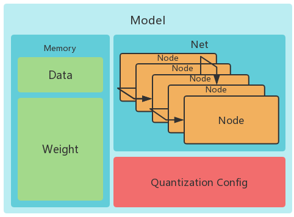
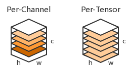
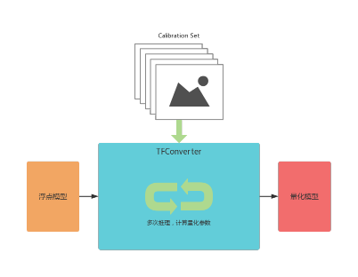
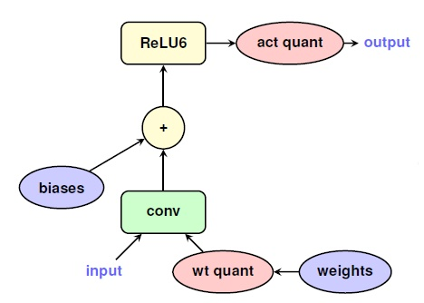
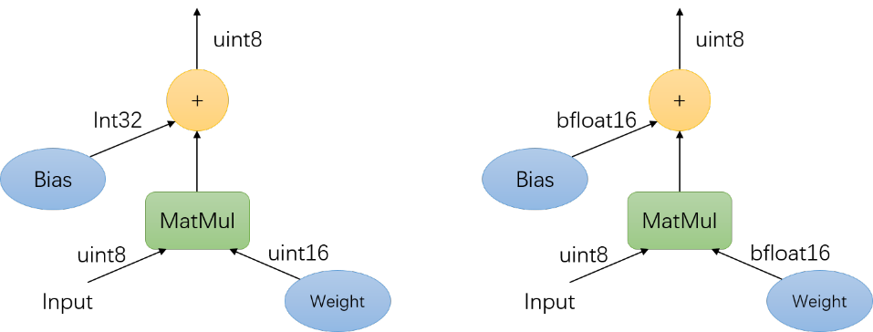
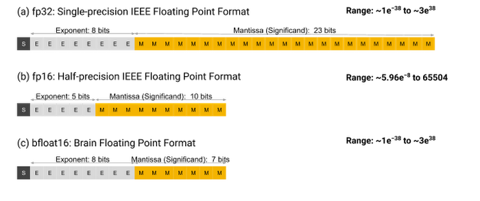

### TFDL2模型

TFDL2使用[FlatBuffers](https://google.github.io/flatbuffers/)作为数据存储格式，FlatBuffers是一个高效的跨平台序列化库。一个TFDL2模型中包含了一个TFDL2网络的拓扑结构、数据类型参数表、量化信息和权重信息。下图显示了一个TFDL2模型中的数据结构

### 模型量化

TFDL2与Think-Force NPU都是为量化模型深度优化的软硬件，因此使用量化过的TFDL2模型在NPU上可以达到最佳的性能。神经网络量化是一个历史深远的课题，而量化的好处是显而易见的：可以在不丢失太多模型精度的同时，极大地提高网络推理的速度。TFDL2使用8bit量化，为了了解这种量化方式，你需要知道：

- [Quantization and Training of Neural Networks for Efficient Integer-Arithmetic-Only Inference](https://arxiv.org/abs/1712.05877)
- [Low-precision matrix multiplication](https://opensource.google/projects/gemmlowp)

TFDL2采用的是非对称均匀8bit量化，将每一个数据块的浮点范围映射到0~255的整数范围，其量化公式如下所示：
$$
f_{float} = S * (q_{uint8} - Z)
$$
其中：`S`是scale，代表缩放尺度；`Z`是zero point，代表零在量化后值中的位置，它们的求解方法是：
$$
Q_{min}\ =\ 0
$$

$$
Q_{max}\ =\ 255
$$

$$
S\ =\ (f_{max}\ -\ f_{min})\ /\ (Q_{max}\ -\ Q_{min})
$$

$$
Z\ =\ min (Q_{max},\ max(Q_{min},\ f_{min}\ /\ S))
$$

TFDL2使用了混合粒度的量化方式，在Convolution、MatMul一类操作的权重上，采用per-channel的量化方式，即每个通道的数据公用一对scale和zero_point；而其它各个操作间的中间结果、网络的输入输出数据使用的是per-tensor的量化参数，即整个data公用一对scale和zero_point。

低精度矩阵乘法是神经网络量化的基础，也是Think-Force NPU致力于提升的算法核心，随着量化神经网络的发展，更多地新算法，例如[Winograd](https://arxiv.org/abs/1509.09308)，也会出现在Think-Force新的硬件中，但是这里我们并不讨论量化神经网络为什么可行，而是关注怎么从浮点神经网络模型得到量化神经网络模型。

### 使用Calibration的模型量化

Calibration（校准）是一种训练后的量化方式，它不影响模型训练的过程，因此用户可以自由地训练自己的浮点模型，然后使用此方法把浮点轻松地模型迁移到量化模型。

模型量化的核心在于量化参数的选择，calibration方法是让模型在一个图集（calibration set）上进行推理，来收集在推理时网络结构中每个data块的数据分布，并依次分布求出该数据块上的量化参数。量化参数的求解受到以下因素的影响：

校准时选择的数据集：数据集大小和数据选择都会对校准造成影响。原则上应当选择大小合适、分布均匀且具有代表性的数据集进行校准；TFConvertor默认选择100张imageNet图集作为校准数据及，在专用网络的校准上，我们推荐使用来自网络训练集内的数据来进行校准，以保证校准集具有一定的代表性。

求解使用的算法：不同的求解算法在不同模型上性能各不相同，这主要是因为在不同的网络模型上，各数据块的分布规律不同，且各部分数据（例如边界值和中心值）的重要性也不相同，为此TFConvertor提供多种校准算法：

**Naive**：在整个calibration set上选择一个data块的最大、最小值作为量化参数，计算scale和zero point。优点是计算简单、校准速度快；缺点是这样选择出来的量化参数与数据块内分布无关，受边界值影响大。
$$
V_{max}\ =\ max[V_{max_1},\ V_{max_2},\ …,\ V_{max_n}];
$$

$$
V_{min}\ =\ min[V_{min_1},\ V_{min_2},\ …,\ V_{min_n}]
$$

**Mean**：在整个calibration set上进行网络推理，记录每个data块在每一次推理时的最大、最小值，完成全部推理后利用收集到的值求算术平均，得到每个data块的量化参数。优点是计算速度同样很快，且有效地规避了边界值的影响；缺点是仍然没有充分利用data块内的分布。
$$
V_{max}\ =\ (V_{max_1} + V_{max_2} + … + V_{max_n})\ /\ n;
$$

$$
V_{min}\ =\ (V_{min_1} + V_{min_2} + … + V_{min_n})\ /\ n
$$

**Entropy**：Entropy算法将首先跑完整个calibration set，并收集每一个data块的分布图；然后枚举出许多组（采样率）不同的最大、最小值，并以此值计算量化参数，并对整个data块进行量化，然后计算量化后分布和原始分布之间的KL散度（截断误差 + 量化误差），并在所有采样结果中选择KL散度最小的一个作为结果来计算量化参数。（注意：此算法中所枚举出的最大、最小值是于0对称的）
$$
P,\ Q\ -\ two\ discrete\ probability\ distributions.
$$

$$
KL_{divergence}(P,\ Q)\ :=\ \Sigma(P[i]\ *\ log(P[i]\ /\ Q[i] ),\ i)
$$

**Coverage**：相比Naive，Coverage增加了一个缩进量，以规避极值带来的影响，缩进量是一个大于0，小于1的浮点数，TFConverter默认使用0.9995。这种方法在许多模型上效果略优于Naive，但它的缩进量是经验总结，在不同模型上的效果不具有逻辑性。
$$
V_{max}\ =\ max[V_{max_1},\ V_{max_2},\ …,\ V_{max_n}]\ *\ coverage;
$$

$$
V_{min}\ =\ min[V_{min_1},\ V_{min_2},\ …,\ V_{min_n}]\ *\ coverage
$$

### 使用Fine-tune提高量化网络精度

Fine-tune是我们推荐在完成网络训练，准备calibration之前进行的步骤。目前，TensorFlow对这个操作有比较全面的支持，它旨在让网络以训练的方式来适应量化推理：在网络结构中插入`fake quantization node`来量化每个节点的activation和weight，再在下一节点输入时反量化。

### One More Step

TFDL2支持灵活的推理数据类型，进而支持混合精度的模型量化，从而解决部分由于8bit量化造成的较大误差。

- Float or int32 bias：TFDL2会将Convolution和BatchNormalization合并，因此会产生一个bias，convolution的操作可以表述为如下公式：
  $$
  y\ =\ x\ *\ kernel\ +\ bias
  $$
  因此在uint8上有：
  $$
  S_y(Y\ -\ Z_y)\ =\ S_x(X\ -\ Z_x)\ *\ S_k(Kernel\ -\ Z_k)\ +\ S_b(Bias\ +\ Z_b)
  $$
  所以为了便于计算，我们令：
  $$
  S_b\ =\ S_x\ *\ S_k;\ Z_b\ =\ 0
  $$
  并且将bias储存为int32格式。由于float格式的bias可以在网络预加载时被量化成int32格式，从而不影响网络运行时间，因此在TFDL2的模型存储中，convolution的weight存储为float格式或者int32格式。

- MatMul with uint16 or bfloat16 weight：TFDL2的全连接层支持使用比8bit更高精度的weight，这是由于全连接层可能出现由于weight分布不均匀，而导致8bit量化不足以还原float权重的分布。在使用uint16作为权重时，算子内部依旧利用gemmlowp模块来计算，在输出位置依然得到int32，并和bias对加后右移到uint8；在使用bfloat16作为权重时，输入处将int8输入也同样反量化到bfloat16，计算后再量化成uint8。

  
  
BFloat16是一种新的数据格式， 深度学习促使了人们对新的浮点数格式的兴趣。通常（深度学习）算法并不需要64位，甚至32位的浮点数精度。更低的精度可以使在内存中存放更多数据成为可能，并且减少在内存中移动进出数据的时间。低精度浮点数的电路也会更加简单。这些好处结合在一起，带来了明显了计算速度的提升。 

 BF16浮点数在格式，介于FP16和FP32之间，它拥有比Float16更广的范围，但是更低的精度。（FP16和FP32是[ IEEE 754-2008](https://www.maixj.net/ict/ieee-754-2008-19897)定义的16位和32位的浮点数格式。） 

