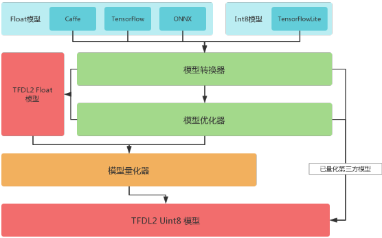
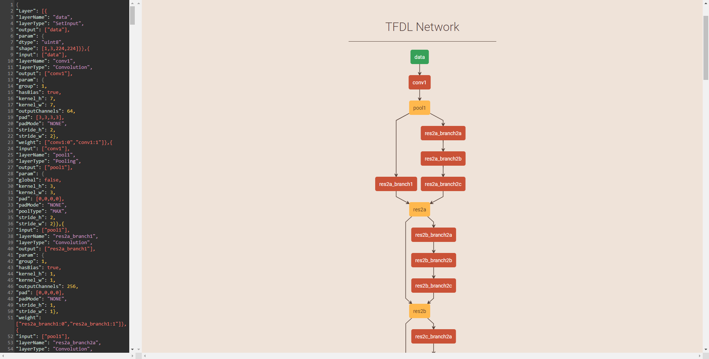
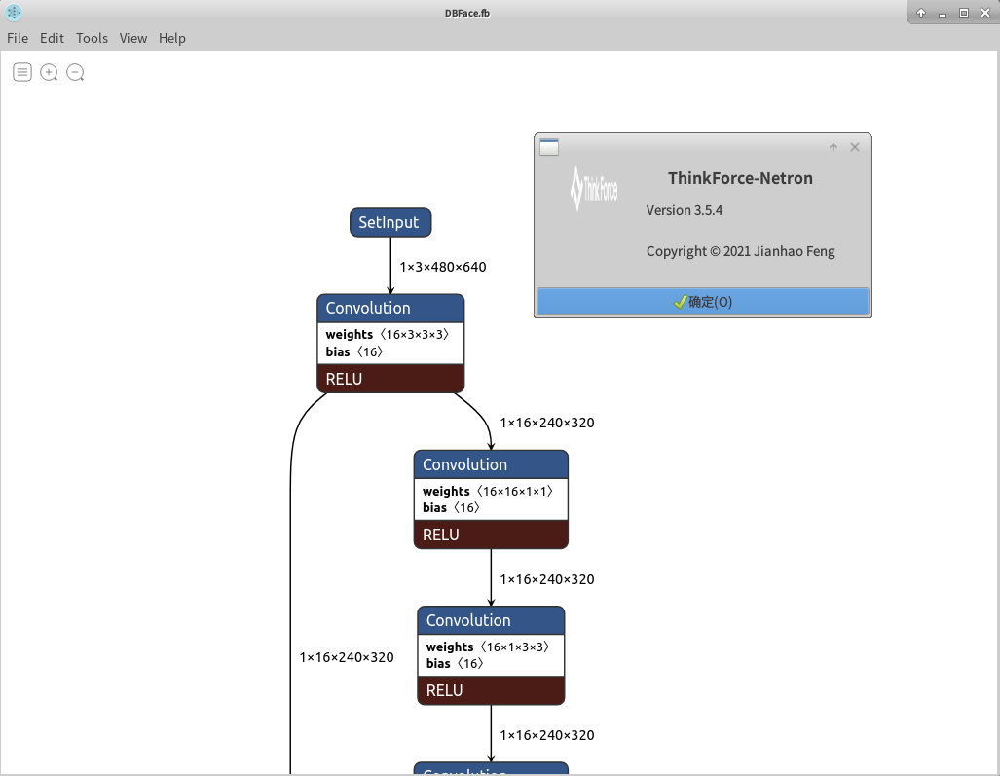

### 编写你的第一个TFDL2程序 - Classification

加载一个TFDL2模型十分容易，TFDL2会自动判断模型的类型和量化方式，TFDL2也拥有自己的基于[FlatBuffers](https://google.github.io/flatbuffers/)的模型存储格式（会在后面的文档中介绍到）。下面的实例程序从加载一个最简单的分类模型开始，输入图片并推理网络，获得网络输出。
```c++
#include <iostream>
#include "TFDL2_C_API.h"
#include "TFCV/TFCV.h"
#include <unistd.h>
#include <sys/stat.h>
#include <iomanip>
#include <fstream>
#include <chrono>
#include <assert.h>
#include <cmath>
#include <algorithm>
using namespace TFDL_CAPI;

int main(int argc, char** argv) {
    std::string imageFile = argv[1];
    std::string labelFile = argv[2];
    bool printinfo = atoi(argv[3]);
    int BATCH_NUM = atoi(argv[4]);
    int prototype = atoi(argv[5]);
    string config = argv[6];
    std::fstream file(config);
    string configstring((std::istreambuf_iterator<char>(file)),
                        std::istreambuf_iterator<char>());
    string config2 = argv[7];
    std::fstream file2(config2);
    string configstring2((std::istreambuf_iterator<char>(file2)),
                         std::istreambuf_iterator<char>());
    std::string protopath = argv[8];
    std::string modelpath = "";
    if(argc>9){
        modelpath = argv[9];
    }
    /* Load labels. */
    std::vector <string> labels;
    std::ifstream inputLabel(labelFile.c_str());
    string line;
    while (std::getline(inputLabel, line))
        labels.emplace_back(line);
    //读取网络结构与参数，生成网路描述上下文（TFContext）
    auto context = LoadProto(protopath);
    //新版SDK保持使用json修改网络的功能，通过以下接口使用json文件修改网络
    ModifyTFContext(context,configstring2);
    //新版SDK将网络结构与运行时分开，用户可以使用上下文生成执行体，每个执行体可以共享同一个上下文的权值内存，并使用
    auto tfExcutor =CompileExecutor(context,true,configstring);
    SetPrintInfo(tfExcutor,printinfo);


    //tfExcutor->SetPreprocess(1.0,{104.006989,116.668770,122.678917},{});
    auto inputtensors = GetInputTensors(tfExcutor);
    std::fstream file_img(imageFile);
    string imgstr((std::istreambuf_iterator<char>(file_img)),
                  std::istreambuf_iterator<char>());
    vector<uint8_t >imgss(imgstr.begin(),imgstr.end());
    //assert(ReadImgtoTensor(inputtensors[0],{imageFile},TFCAPI_TFCV_RGB)==true);
    TFVision tfVision = TFCV::NewImgReader();
    TFCV::OpenSource(tfVision,imgss.data(),imgss.size());
    assert(TFCV::DumpImgData(tfVision,inputtensors[0])==true);
    ForwardExecutorAlone(tfExcutor);
    auto outputtensors = GetOutputTensors(tfExcutor);


    std::vector <std::pair <float , string> > ans;
    std::vector <std::pair <float , string> > tmp;
    if(GetTensorType(outputtensors[0]) == TFCAPI_FLOAT) {
        std::vector<float *> outputs;
        outputs.push_back((float*)GetTensordata(outputtensors[0]));

        for (float *output : outputs) {
            ans.clear();
            for (int i = 0; i < labels.size(); i++) {
                ans.emplace_back(make_pair(output[i], labels[i]));
            }
            sort(ans.begin(), ans.end());
            reverse(ans.begin(), ans.end());
            for (int i = 0; i < 5; i++) {
                auto point = trunc(ans[i].first * 100000) / 100000;
                if (tmp.size() < 5) {
                    tmp.emplace_back(std::pair<float, string>(point, ans[i].second));
                    std::cout << std::left << std::setw(9) << std::setfill('0') << std::showpoint << point << " - "
                              << ans[i].second << std::endl;

                } else {
                    if (tmp[i].first != point || tmp[i].second != ans[i].second) {
                        std::cout << i << ": " << std::left << std::setw(9) << std::setfill('0') << std::showpoint
                                  << point << " - " << ans[i].second << std::endl;
                    }
                }
            }
        }
    }else{
        std::vector<uint8_t *> outputs;
        outputs.push_back((uint8_t *)GetTensordata(outputtensors[0]));

        for (uint8_t *output : outputs) {
            ans.clear();
            for (int i = 0; i < labels.size(); i++) {
                ans.emplace_back(make_pair(output[i], labels[i]));
            }
            sort(ans.begin(), ans.end());
            reverse(ans.begin(), ans.end());
            for (int i = 0; i < 5; i++) {
                auto point = trunc(ans[i].first * 100000) / 100000;
                if (tmp.size() < 5) {
                    tmp.emplace_back(std::pair<float, string>(point, ans[i].second));
                    std::cout << std::left << std::setw(9) << std::setfill('0') << std::showpoint << point << " - "
                              << ans[i].second << std::endl;

                } else {
                    if (tmp[i].first != point || tmp[i].second != ans[i].second) {
                        std::cout << i << ": " << std::left << std::setw(9) << std::setfill('0') << std::showpoint
                                  << point << " - " << ans[i].second << std::endl;
                    }
                }
            }
        }
    }
    return 0;
}
```

使用注释框内的的模型地址、标签地址和图片地址，你会获得如下的输出结果：

```C++
0.270588 - n02119022 red fox, Vulpes vulpes
0.176471 - n02124075 Egyptian cat
0.145098 - n02119789 kit fox, Vulpes macrotis
0.117647 - n02441942 weasel
0.0745098 - n02127052 lynx, catamount
```
### TFDL2转换工具

TFDL2转换工具可以帮助用户将第三方框架的模型转换成TFDL2模型，转换过程主要可以拆解为以下三个步骤：

- 模型格式转换：TFDL2使用FlatBuffers格式对模型进行存储，转换工具会对支持转换的第三方框架模型进行解析，将其结构映射到TFDL2上。
- 模型优化：Optimizer会对转换后的模型进行优化，以简化网络结构，提升推理速度。
- 模型量化：为了高效利用Think-Force NPU，TFDL2转换工具会默认将模型进行量化，如无特别指定，模型会被量化到uint8格式。某些已经量化过的模型（例如TensorFlowLite模型）不会再经过此步骤。量化的算法细节将在后面详细介绍。
<center></center>

TFDL2转换工具是以个可执行文件，为了查看它的用法，你可以：

```bash
/root$./TFConvertor -h
Usage:
[--help]:                      print the help information
<--proto> <args>:              prototype(caffe:1,tensorflow:2,tflite:3) of input file(required)
<--config> <args>:             the config for net building and input setting
<--input_file> <args>:         input protofile file path(required)
<--model> <args>:              input caffemodel file path(optional)
<--quantize> <args>:           if quantize the net to int8(optional)
<--scale> <args>:              scale value perchannel
<--mean> <args>:               mean value perchannel
<--calibration_mode> <args>:   choose which calibration mode to use
<--calibration_list> <args>:   calibration image set, if not implemented, use calibration.bin
<--output> <args>:             output model name
<--coverage> <args>:           coverage value, if not implemented, use 0.9995
<--beta> <args>:               beta value, if not implemented, calculate by default
<--debug> <args>:              whether to print debug information and dump json after calibration
<--cv_flags> <args>:           set flags for TFCV(0:BGR 1:RGB 2:Gray)
<--Modifyconfig> <args>:       set modify json file
<--outversion> <args>:         output file version(default:2)
<--mergeEltwise> <args>:       make eltwise in-out tensor have same int8 config(default:false)
<--mergeConcat> <args>:        make concat in-out tensor have same int8 config(default:true)
<--avoidnode> <args>:          avoid some nodes weight to quantize
<--tokens> <args>:             if calibration list is tokens
<--quantNodes> <args>:         name list for which node quantize
<--stopquantNodes> <args>:     name list for which node stop quantize default empty, that mean quantize all nodes

```

- proto：指输入模型格式选项，现支持caffe、tensorflow和tflite三种；
- config：指转换后模型的各参数选项，包括是否优化模型结构、是否内存复用、输入数据形状等，具体内容可参考缺省文件；
- input_file：输入模型文件的地址；
- mode：由于caffe模型包含prototxt和caffemodel两项，此处增设一个输入caffemodel路径地址的参数；
- quantize：是否量化模型的指令；
- scale：网络输入数据缩放尺度，支持最多通道个；
- mean：网络输入数据均值，支持最多通道个；
- calibration_mode：校准算法模式选择，细节将在后面详细介绍；
- calibration_list：校准算法图集地址；
- output：输出模型名称；
- coverage、beta：校准算法参数，细节将在后面详细介绍；
- debug：调试接口，开启后量化工具会打印量化过程；
- cv_flags：网络输入图像类型标志：可选BGR、RGB或灰度图像。
- Modifyconfig： modify.json文件路径，当转一些奇怪的模型时需要对转出来的模型进行修改可以使用
- outversion： 输出模型针对老SDK：1，还是新SDK：2
- mergeEltwise： 量化时对于eltwise的输入输出张量量化信息是否合并
- mergeConcat： 量化时对于concat的输入输出张量量化信息是否合并
- avoidnode： 量化时哪些节点的weight不量化
- tokens： 量化时不使用图片数据而是文字Tokens
- quantNodes： 量化时需要量化哪些节点，不置顶表示默认全部算子都量化
- stopquantNodes： 量化时到哪个节点结束，这个表示从输入开始量化到指定的这个名字的节点就停止，后面都不量化了。

例如：

```bash
./TFConvertor --proto 1\
    --config ./config.json\
    --input_file /path to your caffe prototxt/ResNet50.prototxt\
    --model /path to your caffe model/ResNet50.caffemodel\
    --quantize 1 --calibration_mode 0\
    --calibration_list /path to your calibration list/calibration.txt\
    --output ResNet_int8\
    --debug 1
```

这样你就会在运行目录下得到：

```
ResNet_int8.fb (以FlatBuffers格式存储的TFDL2模型)
ResNet_int8.json (描述模型结构的json文件，仅在开启调试时生成)
```

```bash
./TFConvertor --proto 4\
    --config ./config.json\
    --input_file /path to your onnx model.onnx\
    --output /path to your output model\
    --scale 0.0039215 0.0039215 0.0039215
    --mean 0 0 0
```

这样你就会在运行目录下得到：

```
model.fb (以FlatBuffers格式存储的TFDL2模型)
```

```bash
./TFConvertor --proto 5\
    --config ./config.json\
    --input_file /path to your tfdl model  model.fb\
    --quantize 1 --calibration_mode 0\
    --calibration_list /path to your calibration list/calibration.txt\
    --output /path to your quantize output model modelQ\
    --scale 0.0039215 0.0039215 0.0039215
    --mean 0 0 0
```

这样你就会在运行目录下得到：

```
modelQ.fb (以FlatBuffers格式存储的TFDL2模型)
```

### 网络结构可视化

- TFDL2生成的json文件可用于可视化网络结构，打开[TFDL-NetScope](http://192.168.1.59:8800/tfdl-web-tools/Net_Scope/#/editor)，将json文件中的内容粘贴在网页左侧的文本框中，按下<kbd>Shift</kbd> + <kbd>Enter</kbd>即可查看网络结构。



- 同时随SDK包一起打包了一个Thinkforce提供的Netron，该Netron可以对我们的模型进行可视化。同时该工具也提供一个可视化的转模型和量化模型的功能，虽然目前此功能对于caffe模型支持不太好（caffe模型需要两个文件，但是Netron的流程只能进一个文件）。对于Onnx和pb，tflite模型目前的流程还是支持的。


### 自定义层编写
自定义操作对于每个操作规定了四个函数，用户只需实现一个自定义层的四个操作，在调用注册接口即可实现注册自定义层。
#####以下是Power层的自定义实现：
```c++
#ifndef NPU40T_POWER_H
#define NPU40T_POWER_H
#include "TFDL2_C_API.h"
#include "CustomCommon.h"
#include "json11.hpp"
#include <cmath>
#include <cstring>
using namespace TFDL_CAPI;
namespace TFDLOP {
    namespace Power {
        // 用户自定义该自定义层的参数结构体
        struct PowerParam{
            float shift = -1;
            float scale = 0.00784313678741455;
            float power = 1;
            uint8_t maptable[256];
            bool isEqual = false;
        };

        /*! 
         *   @brief:  主要处理参数的解析
         *
         */
        void Prepare(TFContext tfContext, TFNode node) {
            json11::Json param;
            string err;
            //自定义层的层参数会以json字符串的形式由Node导出，用户需要调用json的库来解析
            param = json11::Json::parse(GetNodeCustomJsonStr(node),err);
            if(!err.empty()){
                printf("%s\n",err.c_str());
            }
            //申请一个power的参数结构体
            PowerParam *powerParam = new PowerParam();
            //Power层是一个caffe的层，但是在TFDL2中并没有相应的实现（我们提供MathOp包含pow操作）
            powerParam->shift = param["powerParameter"]["shift"].number_value();
            powerParam->scale = param["powerParameter"]["scale"].number_value();
            powerParam->power = param["powerParameter"]["power"].number_value();

            // 这里我们先回收一次自定义层的用户私有指针以防止之前这个Prepare函数被调用过（这个指针由每个Node携带，框架不会修改与回收，只能由用户确保这部分不会内存泄露）
            FreeNodeCustomParam(node, [](void *custromparam) {
                delete (PowerParam *) custromparam;
            });
            // 然后我们调用初始化私有指针的接口，将我们自己申请的结构体赋值到Node里。
            NewNodeCustomParam(node,[&powerParam]()->void*{
                return powerParam;
            });

        }

        /*! 
         *   @brief:  主要处理编译期判断操作前后张量的形状与数据类型
         *
         */
        void Reshape(TFContext tfContext, TFNode node) {
            //这里取出我们实现存入的自定义结构体指针
            PowerParam *powerparam = (PowerParam *) GetNodeCustomParam(node);
            //取出节点信息
            auto info = GetNodeInfo(node);
            //取出节点的输入输出张量
            auto inputData = GetTensorByName(tfContext, info.InputNames[0]);
            auto outputData = GetTensorByName(tfContext, info.OutputNames[0]);
            //这里就是这个函数的核心，需要根据输入张量推断输出张量的形状和数据类型。
            ReSizeTensor(outputData,GetTensorShape(inputData));
            SetTensorType(outputData,GetTensorType(inputData));
            //这里是一段加速代码，当针对int8时，可以建一个查找表，同时也可以判断输入输出是不是相等。
            if(GetTensorType(inputData) == TFCAPI_UINT8 && GetTensorType(outputData) == TFCAPI_UINT8){
                auto inputconfig = GetTensorQuantizeInfo(tfContext,info.InputNames[0]);
                auto outputconfig = GetTensorQuantizeInfo(tfContext,info.OutputNames[0]);
                powerparam->isEqual = true;
                for(int i=0;i<256;i++){
                    float in;
                    uint8_t j = i;
                    DeQuantizeTensorData(&in,&j,1, inputconfig);
                    float out = std::pow(powerparam->shift + powerparam->scale * in, powerparam->power);
                    QuantizeTensorData (&powerparam->maptable[i],&out,1, outputconfig);
                    powerparam->isEqual &= (powerparam->maptable[i] == i);
                }


            }
        }

        /*! 
         *   @brief:  Power自定义操作的推理函数，是之后网络推理时调用的函数
         *
         */
        void Eval(TFContext tfContext, TFNode node) {
            PowerParam *powerparam = (PowerParam *) GetNodeCustomParam(node);
            auto info = GetNodeInfo(node);
            auto inputData = GetTensorByName(tfContext, info.InputNames[0]);
            auto outputData = GetTensorByName(tfContext, info.OutputNames[0]);
            int count = GetTensorCount(inputData,0);

            //开始进行推理计算。
            if (GetTensorType(inputData) == TFCAPI_UINT8 && GetTensorType(outputData) == TFCAPI_UINT8) {
                uint8_t * input = (uint8_t*)GetTensordata(inputData);
                uint8_t * output = (uint8_t*)GetTensordata(outputData);
                if (powerparam->isEqual) {
                    if (input != output) {
                        memcpy(output, input, count);
                    }

                    return;
                }
                SimpleMapdata(output,input,powerparam->maptable,count);
            } else if(GetTensorType(inputData) == TFCAPI_UINT8 && GetTensorType(outputData) == TFCAPI_UINT8){
                float * input = (float*)GetTensordata(inputData);
                float * output = (float*)GetTensordata(outputData);
                for (int i = 0; i < count; i++) {
                    *(output++) = std::pow(powerparam->shift + powerparam->scale * *(input++), powerparam->power);
                }
            }
        }

        /*! 
         *   @brief:  主要处理参数的解析
         *
         */
        void Free(TFContext tfContext, TFNode node) {
            //回收之前写入的自定义结构体。
            FreeNodeCustomParam(node,[](void*custromparam){
                delete (PowerParam *) custromparam;
            });
        }
    }
    /*! 
     *   @brief: 开始算子的注册
     *
     */
    RegistOp(Power)
    .Set(Power::Prepare,Power::Reshape,Power::Eval,Power::Free);
}

#endif //NPU40T_POWER_H

```
从以上过程可以看到，在实现自定义层时最重要的几点：
1. 要及时申请与回收自定义的结构体。
2. 在reshape函数中主要实现对输出张量的形状和数据类型的推理，不可进行内存操作（TFDL中的张量内存申请发生在编译过后，而reshape就是编译期使用的函数）。
3. 当然reshape中也可以根据前后信息做一些加速预处理
4. Eval中要分情况讨论，针对具体输入的数据类型实现相应的推理代码。
5. 最后一定要调用RegistOp函数，对实现的函数进行注册。

###config.json与modify.json的使用
>>>在新SDK中对于编译期采用读取json的形式让用户进行选择，其中config.json是负责处理编译选项的设置文件，而modify.json是上下文修改用设置文件。这样之后迭代过程中<.H>文件可以不变，源代码也可以不变，只通过改变json文件内容来影响神经网络的编译执行过程。一般modify文件可以不用，很少由需要修改模型上下文的情况，重点主要在config文件的使用，这部分直接影响模型编译过程的结果，并影响之后的推理速度。

####modify.json文件如下：
```c++
/*         {
 *               "AddOnPass": [],可选项支持选择优化器（选择是否开启优化器中的哪些选项：并层，对齐等）
 *               "DeleteLayer": [],// 要删除的层的名字列表
 *               "Layer": [
 *                      // 使用json定义的层信息修改列表大致结构如下：
 *                      // 1 修改层量化信息时
 *                      {
 *                          "layerName": "Softmax", // ----- 必须写
 *                          "OutDataMin": [0],// -- 可选，对于Data多通道量化时这个列表长度等于通道数
 *                          "OutDataMax": [1.0]
 *                      }，
 *                      // 2 修改层前后链接信息时
 *                      {
 *                          "input": [
 *                                     "efficientnet-b0/model/blocks_0/batchnorm/add_1" // --- 修改输入节点信息
 *                                    ],
 *                          "layerName": "Quantize0", // ---- 必须写
 *                          "output": [
 *                                      "Quantize0"  // -- 修改输出节点信息
 *                                     ],
 *                      },
 *                      // 3 修改层输出数据类型
 *                      {
 *                          "layerName": "efficientnet-b0/model/head/dense/MatMul",
 *                          "outputDataType":  "TFDtypeFp32"
 *                      }
 *                      // 4 完整的单层描述体：
 *                      {
 *                          "input": [],
 *                          "layerName": "data",
 *                          "layerType": "SetInput",
 *                          "input": [],
 *                          "output": ["data"],
 *                          "outputDataType" : "TFDtypeUint8"          \\ this will allow Mix-precision in one Executor
 *                          "ActivationType": "ReLU"
 *                          "param": {
 *                              "tfDataType": "TFDtypeUint8",
 *                              "mean": [128,128,128],
 *                              "scale": [0.008712500334,0.008712500334,0.008712500334],
 *                              "shape": [1,3,300,300]
 *                          }
 *               }
 *               ]
 *           }
 * /
```

####config.json如下：
```c++
/*          {
 *              "UseHardware":true, -- 是否使用硬件
 *              "FrugalMode": true, -- 开启节省内存模式
 *              "Core": [], -- 该执行体将使用哪几个硬件核心(NPU10T只能支持单执行体单硬件，NPU40T支持单执行体多硬件)
 *              "optimize":{  -- 模型优化选项，在编译网络时这些将被考虑
 *                  "DoAlign":false,
 *                  "TryReverse":false,
 *                  "HighAccuracy": true,
 *                  "SplitDeconv": true
 *              },
 *              "InputShape":[{"NodeName":"input","Shape":[1,3,384,384]}] --- 设置输入节点的形状，之后编译器将按照这一形状生成命令字
 *          }  
 * /
```


