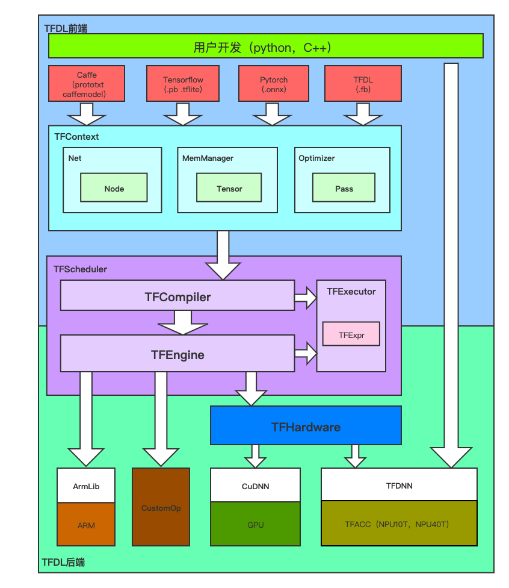

### 什么是TFDL2

TFDL2 (THINK-FORCE DEEP LEARNING 2)：是由 [Think-Force](http://www.think-force.com/) 自主研发，配合 Think-Force NPU 使用的轻量级量化推理框架。它的内核完全由C++编写，可以轻松移植到嵌入式设备；TFDL2对x86、arm以及Think-Force自研的ManyCore<sup>TM</sup>架构进行了汇编级的深度优化，以保证神经网络的高速运行。

### TFDL2可以用来做什么

TFDL2与Think-Force NPU一起，致力于提供高速、轻量化的神经网络推理，为人工智能算法部署赋能。

- 软件开发人员：便捷调用 TFDL2 中封装的算法模块。
- 集成 Think-Force NN IPCore 的异构平台框架开发者：通过 TFDL2 的 API 函数来实现运算加速。
- 深度学习算法研究人员：使用 TFDL2 的前向推理模块，在集成了 Think-Force NPU 的服务器上部署自己的算法。

### 新特性

我们在开发TFDL2时，致力于构建一个灵活性和兼容性更强的框架，在保证易用性和高效性的同时，我们对于框架的下列特性做出了重大提升：

- 更丰富的深度学习操作：除了卷积神经网络中常用的Convolution、FullyConnect等操作外，TFDL2更是支持了许多在现代神经网络中常见的高级网络结构范式，例如[OctConv]( https://arxiv.org/abs/1904.05049 )、[SEBlock](https://arxiv.org/abs/1709.01507)、[ResidualBlock](https://arxiv.org/abs/1512.03385)等，使得这些复杂的网络结构可以轻松获得极高的执行效率。除此之外，TFDL2具有良好的自定义操作支持，你可以用C++编写自己的操作，并与TFDL2一同编译。

- 更灵活的数据格式处理：TFDL2支持使用多种数据结构进行网络推理（当然它们的执行效率是有区别的），例如float或uint8；也支持不同级别的模型量化，你可以根据自己对于网络运行速度和网络精度的需求选择最为合适的量化和运行方式。

- 更全面的第三方框架支持：TFDL2从设计之初便考虑对各个第三方框架的支持，你现在可以轻松地从[Caffe](http://caffe.berkeleyvision.org/)、[TensorFlow](https://tensorflow.google.cn/)、[TensorFlowLite](https://tensorflow.google.cn/lite/)及[ONNX](https://onnx.ai/)转换到TFDL2，更多第三方框架的支持也会在今后的持续开发中不断开放。

### 框架架构简介

TFDL2由上至下可分为三个层面：

- 用户接口：TFDL_C_API，PyTFDL，TFDNN
- 网络结构：TFContext、Optimizer、Net、MemManager
- 网络引擎：TFScheduler、TFEngine,TFCompiler
- 硬件抽象：TFHardware，TFDNN


### 用户接口
- 在TFDL_C_API中提供大量的C/C++的API给到用户，方便用户快速调用TFDL引擎并与其现有的工程进行结合，适合高性能场景。用户也可以使用TFDNN来进行开发
- 在PyTFDL中给用户提供我们的Python接口，方便使用大量的第三方开源库，进行快速开发。
### 网络结构
- TFContext类保存着网络的上下文信息，包括网络结构（Net类）和网络所拥有的内存资源（MemManager类），它的主要功能是保证网络逻辑的通顺性以及网络执行的正确性。用户无法对TFContext类内部的信息直接进行修改和查看，但是用户可以通过Optimizer类对其进行指向性的优化。
- Optimizer类，即TFDL2网络结构优化器，拥有修改网络结构的权力：它包含一系列优化算法，能够在保证网络运算正确的情况下优化网络结构，减少计算时间；同时它也是可配置的，用户可以使用接口来选择对网络仅进行部分优化措施，或者完全不优化。 提供大量我们实现的Pass供用户选择性优化网络结构，以及再转模型过程中的特定优化比如（caffe的inplace特性，tensorflow的biasAdd合并，以及Conv合并BN）
- Net类管理所有的节点（Node），负责处理相应的图算法，维护节点连通。每个节点是可以映射到caffe的layer以及tensorflow的Node和Onnx的Node。节点中会存储节点信息，包括OpType，input，output，NodeName，OpParam。
- MemManager类管理Tensor。负责Tensor的查找和删除增添，以及内存的分配回收等。Tensor只做为张量描述类，不存储内存指针也不会申请和释放内存。
### 网络引擎
- 与第一代SDK相比，这一代为了适应更多硬件场景，以及为了以后多代芯片的继承性，将网络结构与网络执行分离，形成上下文（*TFContext*）和执行体（*TFExecutor*）。同时引入调度器（*TFScheduler*）作为全局静态类，可以对多个执行体的运行执行调度工作，缓解cpu与Npu或者Gpu的相互等待耗时。
- TFCompiler类作为我们自己的编译器，可以高效处理复杂网络结构，并针对我们的硬件进行深度优化。其中编译器会执行一个转译将上下文（*TFContext*）的所有操作，按照等效的执行顺序翻译为一个个表达式（TFExpr）之后随着我们的迭代也会针对这些表达式优化提供更多方案。同时在翻译过程也会针对不同硬件的支持情况使用相应的最快的算子
- TFEngine类管理TFDL中的所有的算子包括用户的自定义算子，同时管理我们的自主设计的ARM CPU算子，以及与硬件抽象层进行交互。
- TFExecutor作为上下文（*TFContext*）编译后的执行类，同时会包含一个上下文（*TFContext*）的副本，此时用户只需与这个类进行交互运行网络和获取网络输出和写入网络输入。而不要与原始的上下文（*TFContext*）进行交互。但是需要注意的是，因为毕竟是编译过后的网络，其结构与内存排布与原始的上下文是不同的，虽然我们会处理部分的映射，但是对于深度优化的网络，会出现部分节点合并消失以及前后链接顺序改变等问题。所以建议对于执行体只需要进行模型推理和处理IO即可，如果要二次修改模型结构，请在原始上下文（*TFContext*）中进行修改。
### 硬件抽象
- TFDNN我们的TFACC抽象接口，作为开发NPU系列的直接接口，同时也支持用户直接使用开发。
- TFHardware负责处理不同硬件之间的差异，提供统一的硬件抽象。同时支持GPU以及NPU，在映射到不同硬件时，会参考不同硬件的限制，相较于用户直接开发硬件会方便很多。

---

## 文档目录

| 文档 | 说明 |
|------|------|
| [API参考手册](API.md) | C/C++ API完整参考：TFContext、TFExecutor、TFTensor、量化、自定义算子等 |
| [使用教程](Tutorial.md) | 快速上手：第一个TFDL2程序、模型转换工具、网络可视化、自定义层编写 |
| [算子参考](Operation.md) | 支持的全部算子/层详细说明：卷积、激活、归约、量化、高级层等 |
| [模型格式与量化](ModelAndQuantization.md) | FlatBuffers模型格式、INT8量化原理、校准算法（Naive/KLD/Mean/Coverage）、混合精度 |
| [性能基准测试](Benchmark.md) | 各类模型在NPU上的推理性能数据、Benchmark工具使用方法、性能优化建议 |
| [Python API手册](PythonAPI.md) | Python SDK使用：TFContext/TFExecutor/Op模块、模型转换、量化、推理示例 |
| [TFCV图像视频模块](TFCV.md) | TFCV视觉IO模块：图片解码、视频流读取、RTSP接入、颜色格式、多路并发 |
| [配置参考](ConfigReference.md) | config.json完整配置项说明、modify.json模型修改语法、典型配置场景 |
| [多线程编程指南](MultiThread.md) | 多执行体并发模式、NPU核心分配、权值共享、线程安全规则、性能调优 |

---

## 支持的硬件平台

| 平台 | 芯片 | NPU核心数 | 用途 |
|------|------|--------|------|
| NPU10T | TF16110 | 4*2（每个簇2个，全芯片4个簇，每个簇独立总线所以跨簇无法访问） | 边缘设备、加速卡 |
| NPU40T | TF7000 | 4+4（4大核+4小核） | 服务器加速卡、边缘服务器 |

## 支持的模型格式转换

| 源格式 | 转换类型编号 | 说明 |
|--------|------------|------|
| Caffe (prototxt + caffemodel) | 1 | 需要同时提供网络结构和权值文件 |
| TensorFlow (pb) | 2 | frozen graph格式 |
| TFLite (tflite) | 3 | TensorFlow Lite量化/浮点模型 |
| ONNX (onnx) | 4 | 推荐使用Python转换工具 |
| TFDL (.fb) | 5 | 对已有TFDL2模型重新量化 |

## 典型工作流程

```
训练模型 (PyTorch/TensorFlow)
        │
        ▼
导出 ONNX / Caffe / TFLite / TF
        │
        ▼
TFConvertor / Python转换工具
  ├── 模型格式转换
  ├── 图优化（合并BN、融合激活等）
  ├── INT8量化校准
  └── 保存为 .fb 文件
        │
        ▼
部署推理
  ├── C++ SDK: LoadProto → CompileExecutor → ForwardExecutorAlone
  ├── Python SDK: TFContext → TFExecutor → executor()
  └── TFApp平台: Host/Slave分布式推理
```
